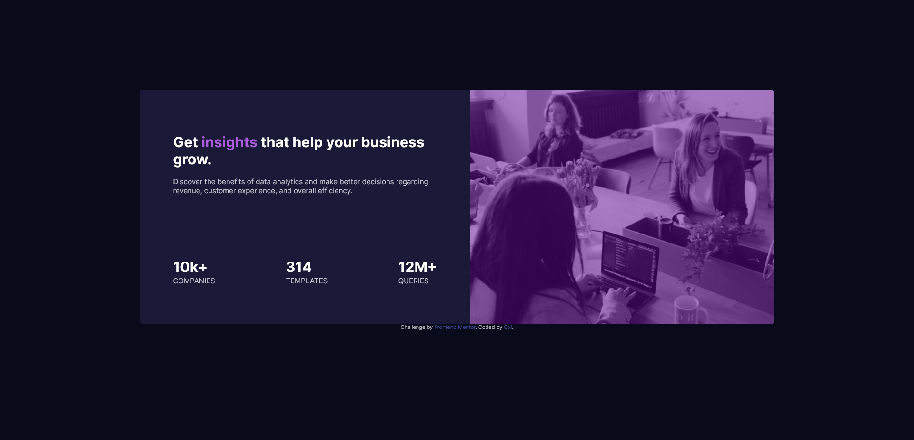

# Frontend Mentor - Stats preview card component solution

This is a solution to the [Stats preview card component challenge on Frontend Mentor](https://www.frontendmentor.io/challenges/stats-preview-card-component-8JqbgoU62). Frontend Mentor challenges help you improve your coding skills by building realistic projects. 

## Table of contents

- [Overview](#overview)
  - [The challenge](#the-challenge)
  - [Screenshot](#screenshot)
  - [Links](#links)
- [My process](#my-process)
  - [Built with](#built-with)
  - [What I learned](#what-i-learned)
  - [Useful resources](#useful-resources)
- [Author](#author)

## Overview

### The challenge

Users should be able to:

- View the optimal layout depending on their device's screen size

### Screenshot

### Links

- Solution URL: [https://github.com/oxi1224/Stats-component/](https://github.com/oxi1224/Stats-component/)
- Live Site URL: [https://oxi1224.github.io/Stats-component/](https://oxi1224.github.io/Stats-component/)

## My process

### Built with

- Semantic HTML5 markup
- CSS custom properties
- Flexbox

### What I learned

I learned to properly use flexbox which will help me with further development.

### Useful resources

- [discord.gg/web](https://discord.gg/web) There are many helpful people who can help you with any problems.
- [https://css-tricks.com/snippets/css/a-guide-to-flexbox/](https://css-tricks.com/snippets/css/a-guide-to-flexbox/) - This website has an amazing guide on the basics of flex.

## Author

- Frontend Mentor - [@ox-i](https://www.frontendmentor.io/profile/ox-i)
- Twitter - [@oxi1224](https://twitter.com/oxi1224)
